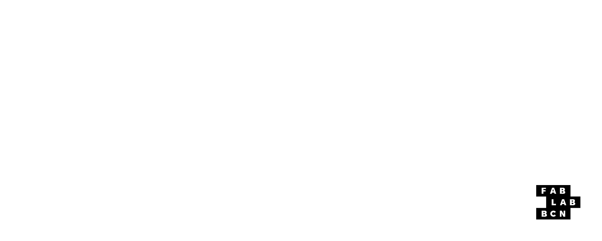
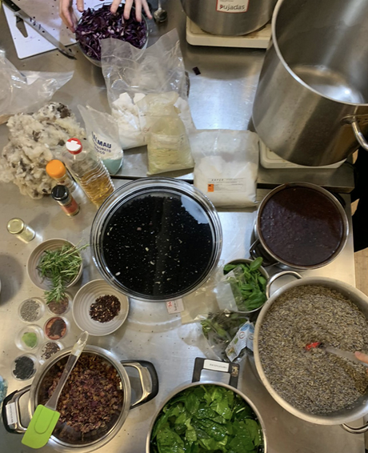
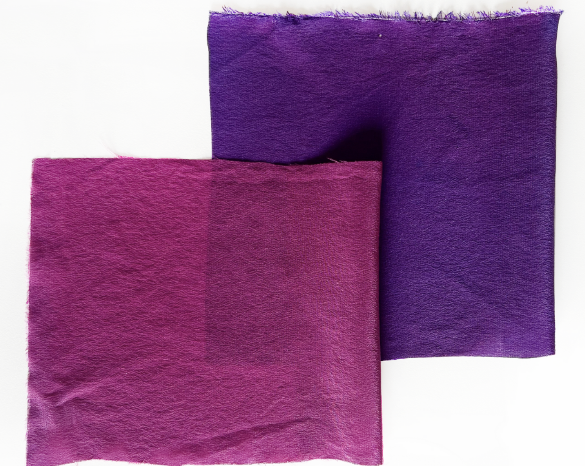

# Reflection
The BioChromes seminar offered an engaging introduction to natural dyeing and sustainable pigment creation. While the hands-on approach and exploration of natural materials were fascinating, the course was not related with my current research. The context and creative experiments were insightful and refreshing. While having some fun exploration without laptop the seminar highlighted the potential of sustainable dyeing techniques.

## BioChromes
BioChromes are natural pigments found in plants, animals, and microorganisms. They serve as eco-friendly alternatives to synthetic dyes, which are linked to environmental harm through toxic waste and chemicals. By harnessing resources like leaves, fruit peels, fungi, and bacteria, BioChromes enable sustainable and interesting coloring for textiles.

### Key Benefits:
Sustainability: Reduces reliance on harmful synthetic processes. 
Versatility: Yields diverse colors using natural pH adjustments and mordants. 

## Materials & Tools
Creating natural dyes requires a combination of tools, materials, and ingredients to achieve consistent and vibrant results.

### Tools:
Pots for heating 
Measuring cups and spoons 
Strainers 
Protective gloves 
Optional: Scale and pH testing strips for precision 

### Key Ingredients:
Mordants: Substances like alum (for bright colors) or iron (for darker shades) that fix dyes to fabric. 
Tannins: Natural compounds such as oak tannins, found in many plants, enhance dye bonding. 
pH Modifiers: Adjust color tones using lemon, vinegar, or sodium bicarbonate. 
### Fabric Preparation:
Weigh and Cut: Measure fabric weight for accurate mordant and dye calculations. 
 
Scour Fabric: Clean the fabric based on type: 
Silk: Warm water rinse.
Cotton, Viscose, Linen: One-hour soak with sodium carbonate.

### Dyeing Process:
Calculate mordant amounts: 
~12% alum for bright colors. 
~1% iron for darker shades. 
Simmer the fabric in the dye bath for 60 minutes. 
Hang fabric to dry naturally. 

## Natural Dye Examples
### Red Cabbage
Pink: 200ml dye bath + 6 teaspoons lemon juice. 
Purple: 200ml dye bath + 12% alum. 
Dark Blue: 200ml dye bath + 1% iron. 
### Eucalyptus
Light Yellow: 350ml dye bath + ½ lemon. 
Golden: 350ml dye bath + 20g alum. 
Gray: 200ml dye bath + ½ teaspoon iron. 

## Experiment Proceses
01 Material Collection: Gathered organic waste like leaves, fruit peels, and vegetable scraps.  
02 Dyeing Process: Experimented with pH levels, temperatures, and natural mordants like alum, lemon, and iron to extract vibrant colors.  
03 Pigment Creation: Transformed leftover dye baths into pigments by mixing with alum and baking soda.  

## Takeaway
While not immediately useful for mypersonal research, the seminar emphasized the importance of sustainability in design and offered a deeper understanding of natural dyeing processes. These techniques could inspire future applications in creative and environmentally conscious projects and for my freetime asside from my personal research.

## Further Ideas 
My initial idea was to use Basil as the color not only might get a strong green but also might smell good. The result was brown color though.
As a Second idea i wanted to use the Ube fruit as it has a strong natural purple color and it even might change with the ph value like the cabbage but i couldn't find any fruit in the given timeframe. If one day i will find the fruit I will try it.