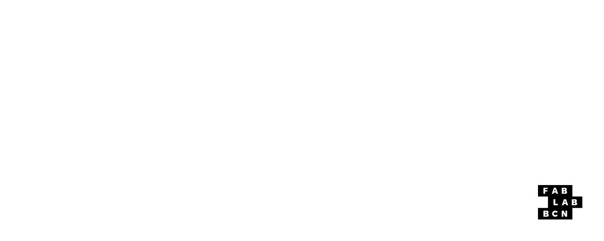
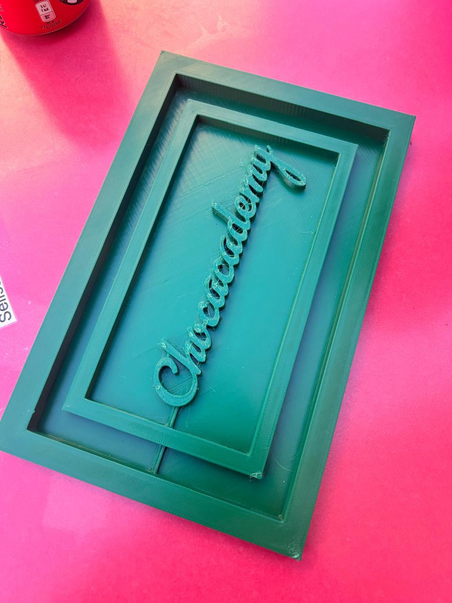
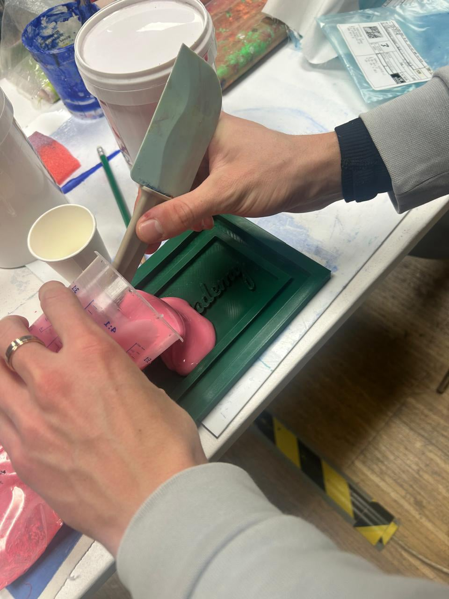
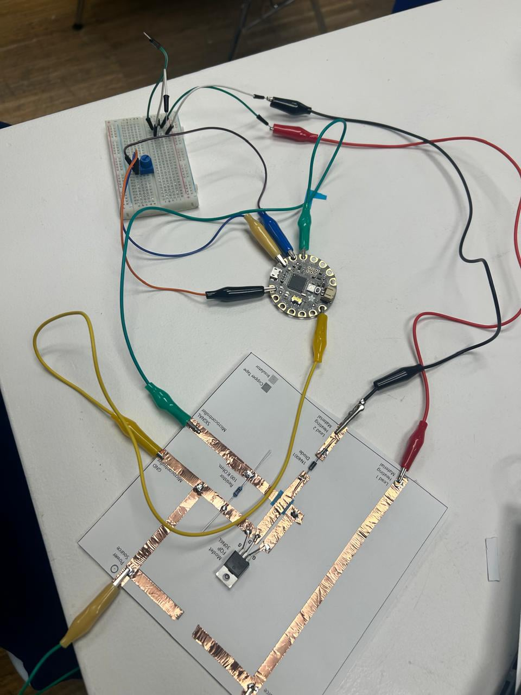
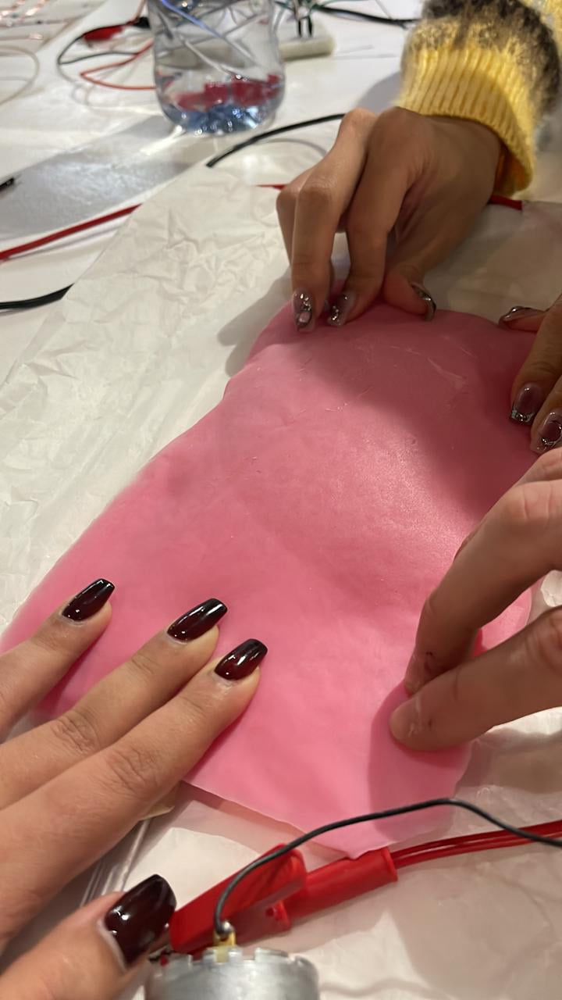
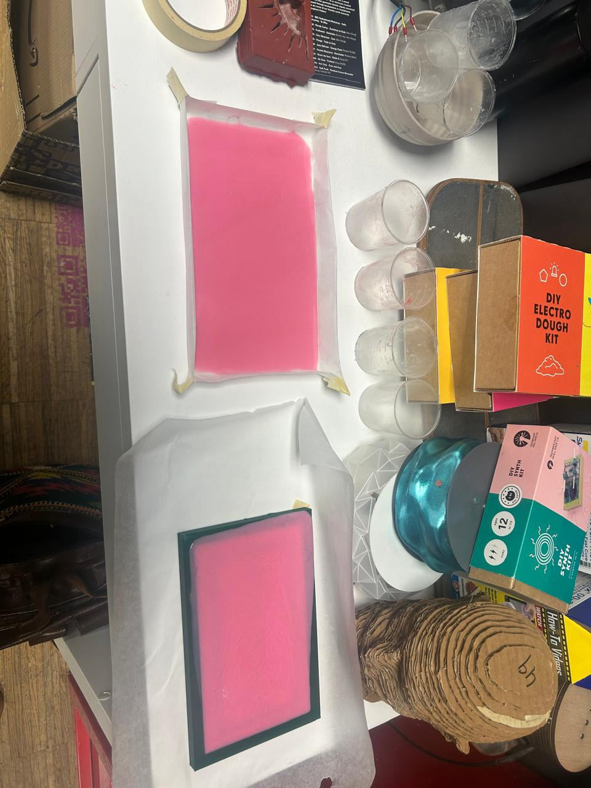

# Reflection
Our experiment with soft robotics to create inflatable chocolate was both a creative exploration and a valuable learning experience. While we couldn't fully achieve our intended result, the process highlighted the importance of material choice, airtightness, and mold design in achieving success. Despite the challenges, the attempt inspired us for more ideas and showed us areas for improvement, such as using better materials and optimizing mold shapes. The Seminar was really interesting and i wish i would have more time to spend on this topic, currently it's not my research direction thogh. 
After exploring with the food material and thinking a lot about potential use cases I would say there is better use cases than inflatable food and with the next experiment i would do something more related to Nature inspired mechanisms like fish swimming or bird wings movement.

## About Soft Robotics
Soft robotics emphasizes flexibility, adaptability, and safety, drawing inspiration from natural organisms. Key components include soft actuators, flexible sensors, and durable materials like elastomers or biomaterials. Its applications span healthcare, agriculture, exploration, and even consumer products.

## Experiment Summary
### Goal: Create an inflatable chocolate mold featuring the "Chocacademy" font.

### Steps:

01 Mold Preparation: Designed and 3D-printed the mold.  

02 Material Experimentation: Used an edible silicone paste to fill the mold. 

03 Mechanism Setup: Programmed an Arduino (Flora) to connect to a motor for air inflation. 

04 Testing: Covered mold holes, attempted inflation, and observed the results. 

### Challenges & Learnings:  
Achieved only slight inflation due to air leakage and a thick mold cover.
Incomplete inflation of the font area highlighted the need for a fully sealed and thinner mold.
The porosity and stickiness of edible silicone proved to be a limitation.

### Next Steps:
Experiment with non-porous, less sticky materials like regular silicone. 
Redesign molds, potentially using circular shapes for uniform inflation. 
Refine the process to incorporate chocolate and achieve the envisioned design. 
Try other mechanisms besides of food applications.  
Try more with silicon. 
Test Vinyl Soft robots aswell. 

